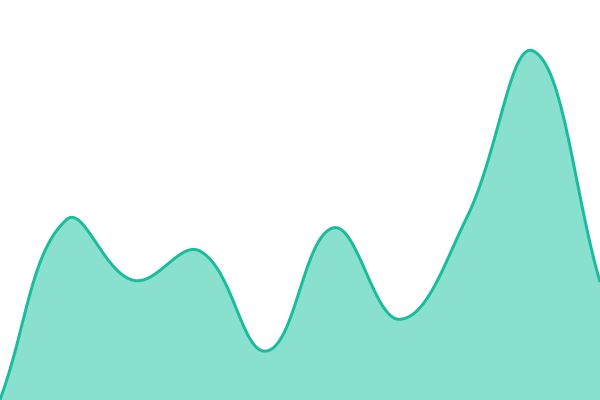

# [📈 Live Status](https://status.musiccloud.io): <!--live status--> **🟩 All systems operational**

This repository contains the open-source uptime monitor and status page for [phranck](https://layered.work), powered by [Upptime](https://github.com/upptime/upptime).

With [Upptime](https://upptime.js.org), you can get your own unlimited and free uptime monitor and status page, powered entirely by a GitHub repository. We use [Issues](https://github.com/phranck/status.musiccloud.io/issues) as incident reports, [Actions](https://github.com/phranck/status.musiccloud.io/actions) as uptime monitors, and [Pages](https://status.musiccloud.io) for the status page.

<!--start: status pages-->
<!-- This summary is generated by Upptime (https://github.com/upptime/upptime) -->
<!-- Do not edit this manually, your changes will be overwritten -->
<!-- prettier-ignore -->
| URL | Status | History | Response Time | Uptime |
| --- | ------ | ------- | ------------- | ------ |
|  [Frontend](https://musiccloud.io) | 🟩 Up | [frontend.yml](https://github.com/phranck/status.musiccloud.io/commits/HEAD/history/frontend.yml) | 

 740ms
     
 | 

<a href="https://status.musiccloud.io/history/frontend">100.00%</a>
    

|  [API](https://api.musiccloud.io/health/ready) | 🟩 Up | [api.yml](https://github.com/phranck/status.musiccloud.io/commits/HEAD/history/api.yml) | 

 678ms
     
 | 

<a href="https://status.musiccloud.io/history/api">0.20%</a>
    

|  [Dashboard](https://dashboard.musiccloud.io) | 🟩 Up | [dashboard.yml](https://github.com/phranck/status.musiccloud.io/commits/HEAD/history/dashboard.yml) | 

 740ms
     
 | 

<a href="https://status.musiccloud.io/history/dashboard">0.18%</a>
    

|  [Developer Site](https://developer.musiccloud.io) | 🟩 Up | [developer-site.yml](https://github.com/phranck/status.musiccloud.io/commits/HEAD/history/developer-site.yml) | 

 767ms
     
 | 

<a href="https://status.musiccloud.io/history/developer-site">0.16%</a>
    

<!--end: status pages-->

[**Visit our status website →**](https://status.musiccloud.io)

## 📄 License

- Powered by: [Upptime](https://github.com/upptime/upptime)
- Code: [MIT](./LICENSE) © [Anand Chowdhary](https://anandchowdhary.com)
- Data in the `./history` directory: [Open Database License](https://opendatacommons.org/licenses/odbl/1-0/)
