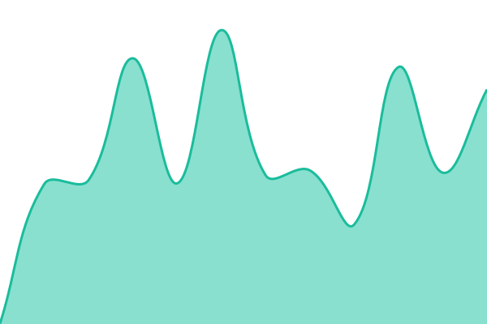
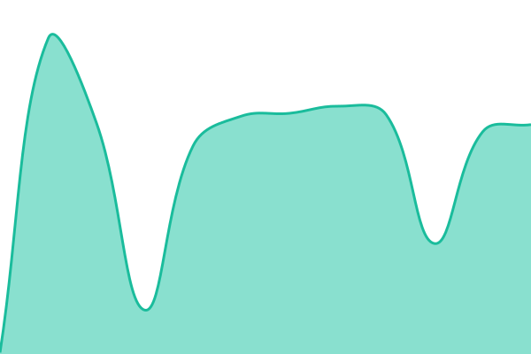
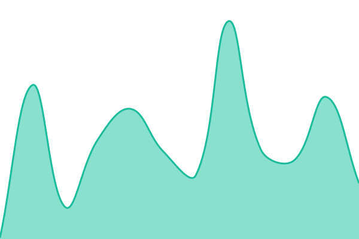
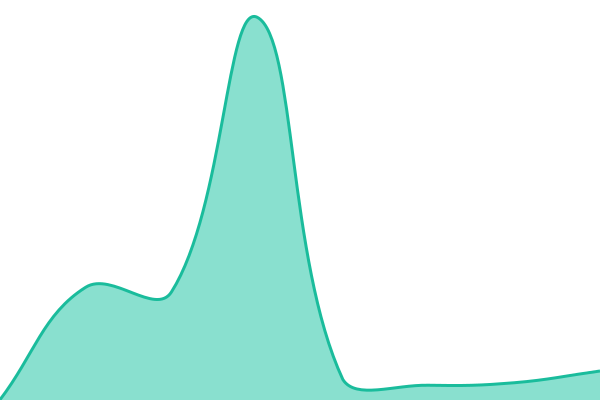

# [📈 Live Status](https://status.musiccloud.io): <!--live status--> **🟩 All systems operational**

This repository contains the open-source uptime monitor and status page for [phranck](https://layered.work), powered by [Upptime](https://github.com/upptime/upptime).

With [Upptime](https://upptime.js.org), you can get your own unlimited and free uptime monitor and status page, powered entirely by a GitHub repository. We use [Issues](https://github.com/phranck/status.musiccloud.io/issues) as incident reports, [Actions](https://github.com/phranck/status.musiccloud.io/actions) as uptime monitors, and [Pages](https://status.musiccloud.io) for the status page.

<!--start: status pages-->
<!-- This summary is generated by Upptime (https://github.com/upptime/upptime) -->
<!-- Do not edit this manually, your changes will be overwritten -->
<!-- prettier-ignore -->
| URL | Status | History | Response Time | Uptime |
| --- | ------ | ------- | ------------- | ------ |
|  [Frontend](https://musiccloud.io) | 🟩 Up | [frontend.yml](https://github.com/phranck/status.musiccloud.io/commits/HEAD/history/frontend.yml) | 

 773ms
     
 | 

<a href="https://status.musiccloud.io/history/frontend">100.00%</a>
    

|  [Frontend IPv6](https://musiccloud.io) | 🟩 Up | [frontend-ipv6.yml](https://github.com/phranck/status.musiccloud.io/commits/HEAD/history/frontend-ipv6.yml) | 

 56ms
     
 | 

<a href="https://status.musiccloud.io/history/frontend-ipv6">100.00%</a>
    

|  [Backend](https://api.musiccloud.io/health) | 🟩 Up | [backend.yml](https://github.com/phranck/status.musiccloud.io/commits/HEAD/history/backend.yml) | 

 674ms
     
 | 

<a href="https://status.musiccloud.io/history/backend">100.00%</a>
    

|  [Backend IPv6](https://api.musiccloud.io/health) | 🟩 Up | [backend-ipv6.yml](https://github.com/phranck/status.musiccloud.io/commits/HEAD/history/backend-ipv6.yml) | 

 75ms
     
 | 

<a href="https://status.musiccloud.io/history/backend-ipv6">100.00%</a>
    

|  [Database](https://api.musiccloud.io/health/ready) | 🟩 Up | [database.yml](https://github.com/phranck/status.musiccloud.io/commits/HEAD/history/database.yml) | 

 360ms
     
 | 

<a href="https://status.musiccloud.io/history/database">100.00%</a>
    

|  [Database IPv6](https://api.musiccloud.io/health/ready) | 🟩 Up | [database-ipv6.yml](https://github.com/phranck/status.musiccloud.io/commits/HEAD/history/database-ipv6.yml) | 

 29ms
     
 | 

<a href="https://status.musiccloud.io/history/database-ipv6">100.00%</a>
    

|  [Email](https://api.musiccloud.io/health/email) | 🟩 Up | [email.yml](https://github.com/phranck/status.musiccloud.io/commits/HEAD/history/email.yml) | 

 429ms
     
 | 

<a href="https://status.musiccloud.io/history/email">95.94%</a>
    

|  [Email IPv6](https://api.musiccloud.io/health/email) | 🟩 Up | [email-ipv6.yml](https://github.com/phranck/status.musiccloud.io/commits/HEAD/history/email-ipv6.yml) | 

 195ms
     
 | 

<a href="https://status.musiccloud.io/history/email-ipv6">100.00%</a>
    

|  [Dashboard](https://api.musiccloud.io/health/dashboard) | 🟩 Up | [dashboard.yml](https://github.com/phranck/status.musiccloud.io/commits/HEAD/history/dashboard.yml) | 

 566ms
     
 | 

<a href="https://status.musiccloud.io/history/dashboard">80.75%</a>
    

|  [Dashboard IPv6](https://api.musiccloud.io/health/dashboard) | 🟩 Up | [dashboard-ipv6.yml](https://github.com/phranck/status.musiccloud.io/commits/HEAD/history/dashboard-ipv6.yml) | 

 107ms
     
 | 

<a href="https://status.musiccloud.io/history/dashboard-ipv6">100.00%</a>
    

|  [Developer Site](https://api.musiccloud.io/health/developer) | 🟩 Up | [developer-site.yml](https://github.com/phranck/status.musiccloud.io/commits/HEAD/history/developer-site.yml) | 

 711ms
     
 | 

<a href="https://status.musiccloud.io/history/developer-site">80.76%</a>
    

|  [Developer Site IPv6](https://api.musiccloud.io/health/developer) | 🟩 Up | [developer-site-ipv6.yml](https://github.com/phranck/status.musiccloud.io/commits/HEAD/history/developer-site-ipv6.yml) | 

 59ms
     
 | 

<a href="https://status.musiccloud.io/history/developer-site-ipv6">100.00%</a>
    

<!--end: status pages-->

[**Visit our status website →**](https://status.musiccloud.io)

## 📄 License

- Powered by: [Upptime](https://github.com/upptime/upptime)
- Code: [MIT](./LICENSE) © [Anand Chowdhary](https://anandchowdhary.com)
- Data in the `./history` directory: [Open Database License](https://opendatacommons.org/licenses/odbl/1-0/)
